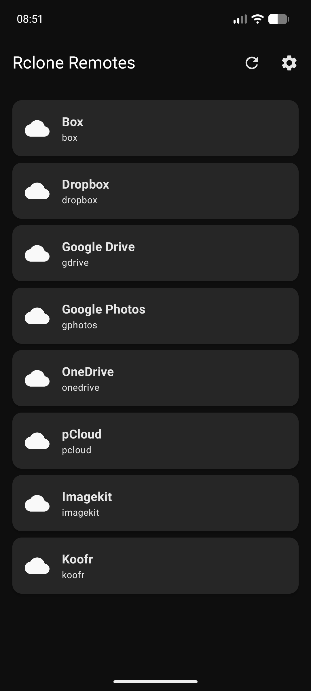

# Rclone Remotes

Android app for managing cloud storage via [rclone](https://rclone.org/). Converted from the Python TUI [rclone_remotes.py](https://github.com/adegard/RcloneRemotes) to Kotlin/Jetpack Compose.



## Features

- **Multi-remote support** - Box, Dropbox, Google Drive, Google Photos, OneDrive, pCloud, and any custom rclone remote
- **File browser** - navigate directories, view file icons and sizes
- **File operations** - create, delete, rename, move files and folders
- **CSV editor** - edit CSV files directly in the app
- **Text editor** - view and edit text-based files (.py, .md, .json, .txt, etc.)
- **Upload/Download** - upload files from device, download to Downloads folder
- **Sync Local -> Remote** - sync a local folder to the cloud
- **Sync Remote -> Local** - sync cloud folder to device
- **Sync Remote -> Remote** - sync between two different cloud providers
- **Folder pickers** - browseable folder selectors for both local and remote paths
- **Quota display** - see storage usage per remote
- **Settings & diagnostics** - test rclone binary, import config, view diagnostics

## Requirements

- Android 8.0+ (API 26)
- [rclone.conf](https://rclone.org/docs/#configure) with your cloud provider tokens

## Setup

1. Install the APK
2. Open the app - you'll see "No remotes found" on first launch
3. Get your `rclone.conf` from your computer or Termux:
   ```bash
   # From Termux:
   cp ~/.config/rclone/rclone.conf /sdcard/Download/rclone.conf
   ```
4. Tap **Settings** (gear icon) -> **Import rclone.conf** -> select the file
5. Go back - your remotes should appear

> The rclone binary is bundled in the APK. You only need to provide `rclone.conf`.

## Build from source

```bash
git clone https://github.com/adegard/RcloneRemotes.git
cd RcloneRemotes

# Place rclone binary for ARM64:
# (from a device with rclone installed)
cp $(which rclone) app/src/main/jniLibs/arm64-v8a/librclone.so

./gradlew assembleDebug
```

APK output: `app/build/outputs/apk/debug/app-debug.apk`

## Tech stack

- Kotlin
- Jetpack Compose (Material 3)
- MVVM architecture
- rclone CLI via ProcessBuilder
- Gradle 8.11.1 + AGP 8.7.3

## License

MIT
